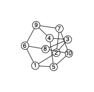
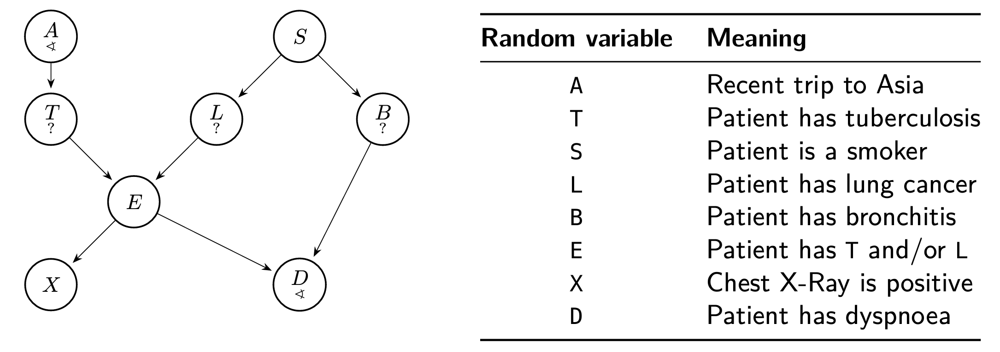

# SimpleTensorNetwork

## Example 1: Spin-glass partition function
This example computes the partition function of an anti-ferromagnetic Ising model on the Petersen graph. The Petersen graph is a graph with 10 vertices and 15 edges.
```julia
edgs = [(1, 2), (1, 5), (1, 6), (2, 3),
(2, 7), (3, 4), (3, 8), (4, 5),
(4, 9), (5, 10), (6, 8), (6, 9),
(7, 9), (7, 10), (8, 10)]
```


The energy model is given by the Hamiltonian
```math
H(\boldsymbol{\sigma}) = -\sum_{(i,j) \in E} J_{ij} \sigma_i \sigma_j
```
where the coupling constants are given by the adjacency matrix of the Petersen graph.

The partition function is given by
```math
Z = \sum_{\boldsymbol{\sigma}} \exp(-\beta H(\boldsymbol{\sigma}))
```
where the sum is over all possible spin configurations.

## Example 2: Bayesian network

This example is from the [TensorInference.jl](https://github.com/TensorBFS/TensorInference.jl) package. The graph below corresponds to the *ASIA network*, a simple Bayesian model used extensively in educational settings. It was introduced by Lauritzen in 1988 [^lauritzen1988local].



Conditional probability tables (CPTs) are given by
```julia
```

## References
[^lauritzen1988local]: Steffen L Lauritzen and David J Spiegelhalter. Local computations with probabilities on graphical structures and their application to expert systems. *Journal of the Royal Statistical Society: Series B (Methodological)*, 50(2):157–194, 1988.